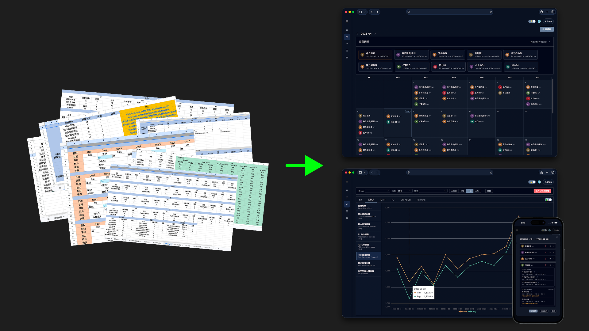

# 訓練週期管理平台 / Training Cycle Platform

> 一套為體能教練打造的整合式管理平台，將週期課表設計、排程與 VALD Performance 檢測數據整合在同一個系統中。

本 Repo 僅存放**專案介紹文件與截圖**，不包含原始碼。

---

## 解決的問題

教練原本依賴 **Google Sheets** 手動對照 [VALD Performance](https://valdperformance.com/)（服務全球 4,000+ 頂尖運動與國防單位的體能檢測系統）的數據，
再以獨立 Sheet 規劃每位學員的週期課表。流程碎片、重工多、查舊資料要跨 sheet，瑣碎耗時。

本平台把三件事綁到一起：

- **週期課表設計**：模板化、可複用、支援固定 / 週期兩種模式
- **VALD 數據整合**：一鍵同步運動員檔案與檢測數據，自動計算 DSI / EUR 衍生指標
- **行事曆排程**：把課表加到日期上，學員當天打開就看到今日訓練

---

## 導入後的實際改善

| 項目           | 舊流程            | 新流程                         | 提升           |
| -------------- | ----------------- | ------------------------------ | -------------- |
| 單人排課耗時   | 45 分鐘           | 10 分鐘內                      | **75%+**       |
| 第三方數據輸入 | 15分鐘            | 一鍵同步（依筆數約十秒內完成） | **95%+**       |
| 課表安排       | 跨多個 sheet 對照 | 行事曆排程介面 + 數據圖表      | 不再需要 sheet |
| 共用資料修改   | 50+ 次重複操作    | 1 次                           | **50x**        |

---

## 技術棧

**後端**

- .NET 10 / ASP.NET Core Web API
- Entity Framework Core 10 + PostgreSQL (Npgsql)
- ASP.NET Identity（JWT Bearer 認證 + Refresh Token）
- Serilog 結構化日誌
- Swashbuckle (OpenAPI)
- 整合 VALD Performance API（OAuth2 Client Credentials）
- 測試：xUnit + Moq（單元測試）；Testcontainers for PostgreSQL（整合測試，跑真實資料庫）
- CI/CD：GitHub Actions（push 觸發 build / 單元 + 整合測試），通過後依分支自動部署 dev / prod（Render Deploy Hook）

**前端**

- Vue 3 + TypeScript + Vite
- Pinia 狀態管理、Vue Router
- 從 swagger.json 自動產生 OpenAPI TypeScript 型別
- Element Plus + Tailwind CSS
- 支援深色 / 淺色模式切換
- 響應式設計（RWD）
- Vue I18n 多語系介面
- ECharts（檢測數據趨勢圖）
- 測試：Vitest（單元）+ Playwright（E2E）
- CI/CD：GitHub Actions（push 觸發 build / Vitest / Playwright），通過後依分支自動部署 dev / prod（Render Deploy Hook）

**部署 / 基礎建設**

- Render（dev / prod 雙環境，透過 Deploy Hook 觸發）
- PostgreSQL 作為主資料庫
- 本地快取 VALD 檢測指標，降低對第三方 API 的依賴與延遲

---

## 文件導引

### 週期課表（Training Cycle）

- [`docs/cycle-concept-guide.md`](docs/cycle-concept-guide.md) — 概念說明（給教練、產品、非工程背景）
- [`docs/cycle-technical-design.md`](docs/cycle-technical-design.md) — 技術設計（給工程師）

### VALD 整合（VALD Performance Integration）

- [`docs/vald-concept-guide.md`](docs/vald-concept-guide.md) — 概念說明（給教練、產品、非工程背景）
- [`docs/vald-technical-design.md`](docs/vald-technical-design.md) — 技術設計（給工程師）

---

## 系統角色

| 角色    | 權限範圍                                |
| ------- | --------------------------------------- |
| Admin   | 全系統管理                              |
| Coach   | 設計課表、排程、同步 VALD、查看所有學員 |
| Athlete | 僅查看自己的課表與檢測歷史              |
