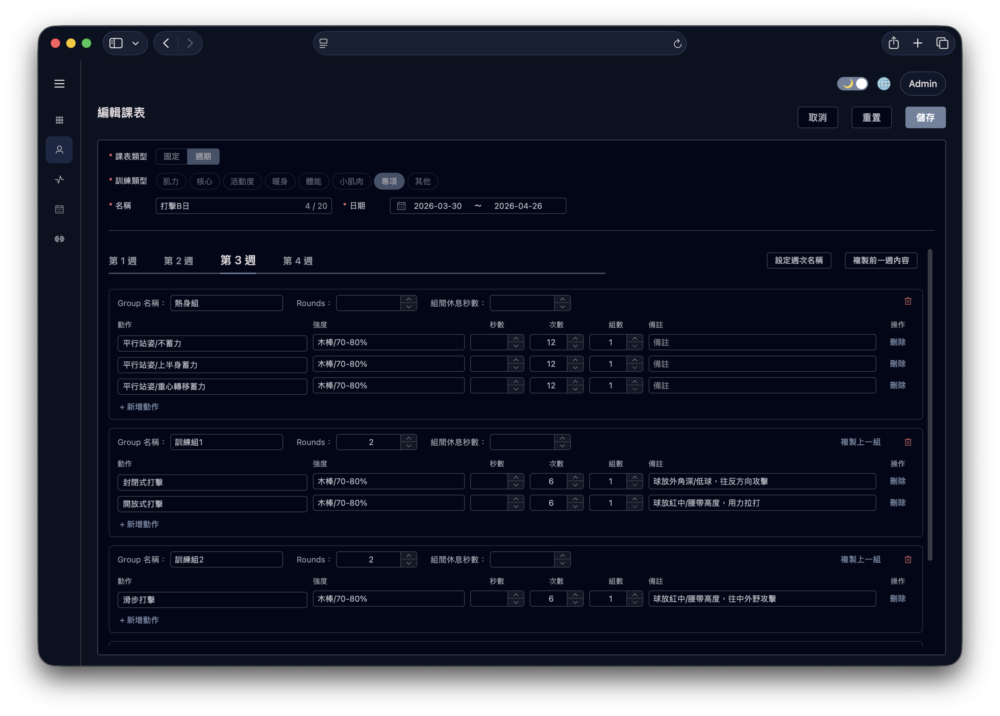
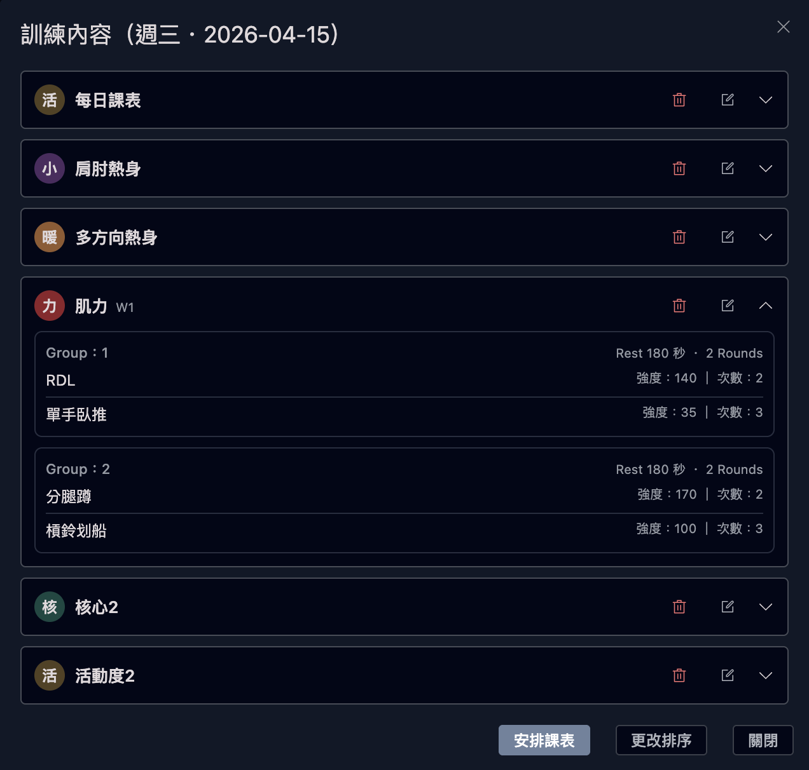
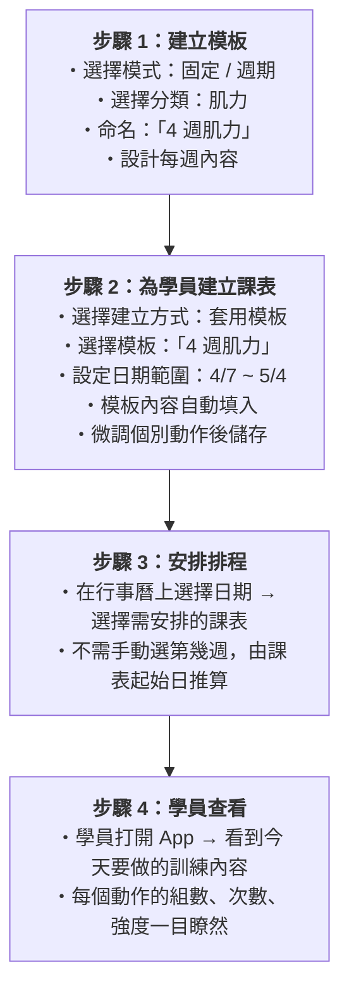

# 週期課表 — 概念說明文件

> 適用對象：教練、營運人員等非工程背景人員

---

## 這是什麼？

週期課表系統讓教練可以**設計訓練計畫**，並**安排到學員的每日行程**中。

想像一位教練要幫 10 位學員規劃肌力訓練。教練可以：

1. 先建立一個「肌力訓練模板」
2. 把這個模板套用到不同學員身上
3. 每位學員的課表獨立運作，可個別微調

---

## 核心概念

### 一、課表的組成結構

一份課表就像一本「訓練手冊」，裡面分成好幾層：

| 層級     | 說明           | 舉例                 |
| -------- | -------------- | -------------------- |
| **課表** | 整份訓練計畫   | 「打擊B日」          |
| **週次** | 課表中的每一週 | 第 1 週、第 2 週...  |
| **群組** | 一組相關的動作 | 熱身組..             |
| **動作** | 具體要做什麼   | 分手握棒打擊 x 12 次 |

每個動作可以設定：

| 項目             | 說明                                   | 範例                            |
| ---------------- | -------------------------------------- | ------------------------------- |
| 組數 (Sets)      | 做幾組                                 | 1                               |
| 次數 (Reps)      | 每組做幾次                             | 12                              |
| 秒數 (Seconds)   | 計時型動作的持續時間                   | 30 秒                           |
| 強度 (Intensity) | 自由文字，可填重量、百分比、器材註記等 | `140`、`BW+10`、`木棒，80-85%`  |
| 備註 (Notes)     | 額外提醒                               | `T 座，放 10-11 中間，腰帶高度` |

群組還可設定「循環組」模式——設定循環次數和組間休息時間，讓群組內的動作重複循環。

---

### 二、兩種課表模式

系統提供兩種課表模式，適用不同情境：

#### 固定課表

> 「每次來都練一樣的內容」

- 沒有週次的區分
- 適合不需要週期變化的訓練，例如：固定的暖身流程、活動度訓練

#### 週期課表

> 「每週練不同的內容，循環進行」

- 包含多個週次，每週可以有不同的訓練安排
- 適合需要漸進式超負荷或週期化的訓練計畫
- 畫面上以**分頁 (Tab)** 呈現，每頁一週

---

### 三、模板與學員課表

#### 模板（課表範本）

> 「教練的教學設計藍圖，可反覆使用」

- 模板**不屬於任何學員**，是教練的通用設計
- 教練可以任意新增、刪除週次
- 可被多次套用到不同學員

**適用情境：**
教練設計了一套「初學者 4 週肌力計畫」模板，之後可以套用給任何新來的學員。

#### 學員課表

> 「屬於特定學員的訓練計畫」

- 綁定在**特定學員**身上
- 有明確的**起始日和結束日**
- 週數由日期區間自動計算（以星期一為一週的起始）
- 建立方式有三種：

| 建立方式         | 說明                               |
| ---------------- | ---------------------------------- |
| **手動建立**     | 從頭開始設計，逐一填寫內容         |
| **套用模板**     | 從現有模板複製內容，再做調整       |
| **套用過去排程** | 從該學員過去某段時間的安排複製過來 |

**重要：** 學員課表一旦建立就是**獨立的副本**，修改模板不會影響已套用的學員課表，反之亦然。

---

### 四、排程（Schedule）

> 「把課表安排到行事曆上」

排程是連接「課表內容」和「日期」的橋樑。

**一天通常是多份課表的組合：**

**排程的特性：**

- 一天可以安排多筆排程，跨分類混合（如上例）
- 排程日期必須在課表的起始日至結束日範圍內
- 同一天的多筆排程可以調整順序

---

### 五、訓練分類

每份課表都會標記一個訓練分類：

| 分類                 | 說明           |
| -------------------- | -------------- |
| 暖身 (WarmUp)        | 訓練前暖身     |
| 活動度 (Mobility)    | 關節活動度訓練 |
| 核心 (Core)          | 核心肌群訓練   |
| 體能 (Conditioning)  | 心肺/體能訓練  |
| 肌力 (Strength)      | 肌力訓練       |
| 小肌群 (SmallMuscle) | 輔助肌群訓練   |
| 技術 (Skill)         | 專項技術訓練   |
| 其他 (Other)         | 未分類         |

分類的作用：

- 篩選與整理課表
- 決定可選的動作清單（每個動作歸屬特定分類）

---

### 六、動作庫

系統維護一份**全域動作庫**，教練在設計課表時可以從中挑選動作。

每個動作包含：

- 名稱
- 主要肌群
- 使用器材
- 教學影片連結
- 動作說明

動作庫是共用的，所有課表都可以引用同一個動作。如果動作從動作庫中被刪除，已經使用該動作的課表項目會保留（名稱仍在），只是不再連結到動作庫。

---

## 操作流程圖示

### 教練的典型工作流程

---

## 常見問題

**Q：修改模板會影響已套用的學員課表嗎？**
A：不會。學員課表建立後就是獨立的副本，與模板互不影響。

**Q：固定課表可以改成週期課表嗎？**
A：建立後不可更改模式。如需變更，請建立新的課表。

**Q：一個學員可以有多份課表嗎？**
A：可以。例如一份肌力課表 + 一份暖身課表，安排在不同日或同一天。

**Q：刪除課表會怎樣？**
A：課表下的所有週次、動作群組、動作項目，以及已安排的排程都會一併刪除。

**Q：週數是怎麼計算的？**
A：系統以**星期一**為每週的起始日。設定起始日到結束日後，自動計算涵蓋幾週。

**Q：排程可以安排在課表日期範圍之外嗎？**
A：不可以。排程日期必須在課表的起始日到結束日之間。
