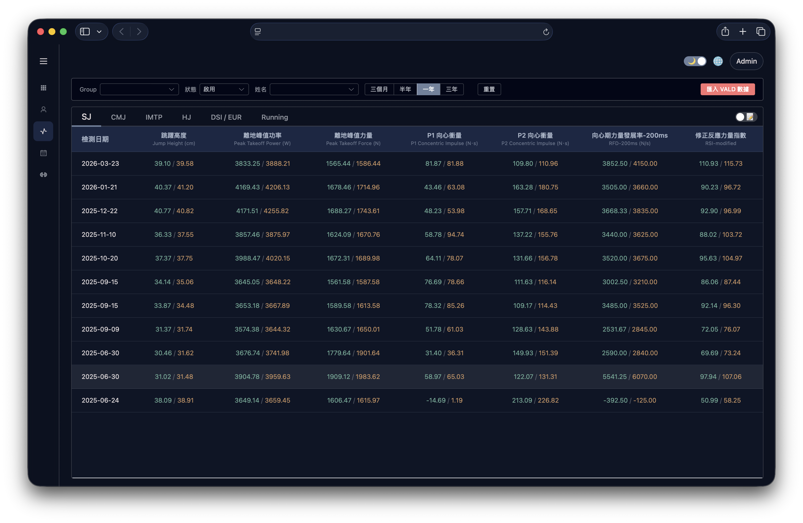
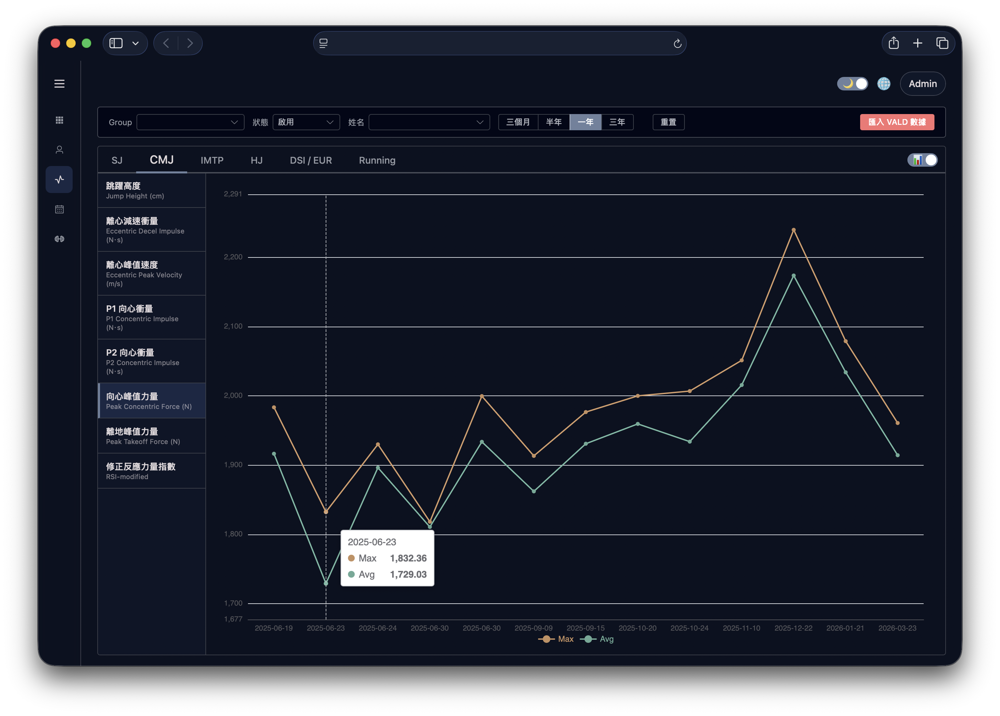

# VALD 整合 — 概念說明文件

> 適用對象：教練、營運人員等非工程背景人員

---

## 這是什麼？

**VALD Performance** 是全球體能檢測領域的主流設備供應商，服務超過 4,000 個頂尖運動與國防單位。教練用它的器材（例如 ForceDecks 測力板）量測運動員的跳躍高度、爆發力、最大肌力等數據。

本系統將 VALD 的檢測資料**直接拉進我們的平台**，讓教練：

1. 不用再到 VALD 官方後台逐項目點擊切換查詢
2. 不用再手抄數據到 Google Sheets
3. 能在同一個頁面上綜合比對趨勢，安排訓練時快速參考



---

## 核心概念

### 一、資料串接的三個來源

系統同時管理三類資訊，並把它們綁在同一位運動員身上：

```
VALD Profile   （運動員基本檔案：姓名、生日、性別、所屬群組）
     │
     ├──▶  系統帳號（自動建立，角色為「運動員」）
     │
VALD Test      （跳躍、蹲舉等力板檢測結果）
     │
     └──▶  本地快照（供歷史趨勢圖）

跑步 / VO2Max  （由教練手動輸入的速度 / 耐力數據）
     │
     └──▶  與 VALD 數據並列顯示
```

---

### 二、Group（群組）

VALD 後台以「Group」來分組運動員。

- 系統進入 VALD 資料頁時，先選 Group，再選運動員，避免一次載入上百位。
- 同步新運動員時，教練可以指定某一個 Group，一次匯入。
- Group 資料來自 VALD 本身，系統不另行維護一份。

---

### 三、同步運動員（Sync Profiles）

> 「把 VALD 上的人一鍵帶進系統」

每當有新運動員被加入 VALD，教練只要在本系統點一下「同步」，系統就會：

1. 呼叫 VALD API 拿到該 Group 的所有運動員檔案
2. 跳過已經在系統內的人（避免重複）
3. 幫新的人建立系統帳號
4. 角色自動設為「運動員」
5. 回報結果：成功幾位、失敗幾位（例如 email 與系統既有使用者衝突）

**為什麼這樣設計？** 教練在 VALD 建檔是既有習慣——但更關鍵的理由是 VALD API 本身的限制讓「雙向綁定 / 雙向同步」幾乎不可行：

- **VALD profile 沒有強制的唯一辨識**：相同姓名、生日、email 的資料可以被重複建立無數次。
- **Email 在同一 tenant 內不唯一**：無法只靠 email 做配對。
- **建立與更新共用同一個端點（`POST /profiles/import`）**：VALD 的匹配規則是「先比對 SyncId、再比對姓名＋生日＋email、最後姓名＋生日」才決定這次請求是更新還是新增。一旦我方傳錯任一欄位，可能悄悄建出一筆重複 profile，而不是報錯。

因此本系統採「**VALD 為單一真實來源**」：只讀取 VALD 的 `ProfileId` 作為錨點、只從 VALD 拉進我方，不反向寫回 VALD，避免汙染對方資料庫、也避免重複建檔。

---

### 四、檢測資料類型

系統從 VALD 拉取的檢測 (Test) 涵蓋以下四種類型：

| 代碼     | 中文名稱                              | 用途                 |
| -------- | ------------------------------------- | -------------------- |
| **SJ**   | 蹲踞跳 (Squat Jump)                   | 純向心爆發力         |
| **CMJ**  | 反向跳 (Countermovement Jump)         | 含離心預蓄力的爆發力 |
| **IMTP** | 等長中段拉 (Isometric Mid-Thigh Pull) | 最大等長肌力         |
| **HJ**   | 連續跳 (Hop Jump)                     | 反應力量指數         |

每一次檢測會記錄多個指標，例如跳躍高度、峰值力量、RFD（力量發展率）等。系統**只抓常用的 20+ 個核心指標**，其餘忽略，避免資料雜訊。

---

### 五、衍生指標：DSI 與 EUR

有兩個指標不是 VALD 直接提供、而是由本系統自動計算：

#### DSI — 動態肌力指數

> 「你的爆發力有發揮出你的最大肌力嗎？」

```
         CMJ 的 Peak Takeoff Force （爆發時產生的力量）
DSI = ─────────────────────────────────────────────
         IMTP 的 Peak Vertical Force （最大能出的力量）
```

- **DSI 越低**：最大肌力很強但爆發時發揮不出來，建議多做速度 / 爆發訓練
- **DSI 越高**：爆發能力好，可能還有最大肌力進步空間

#### EUR — 離心利用率

> 「你的反向動作（下蹲再跳）能不能多跳比較高？」

```
         CMJ 的跳躍高度
EUR = ───────────────────
         SJ 的跳躍高度
```

- 反映運動員利用「離心蓄力」轉換成向心爆發的效率
- 數值 > 1 代表有利用到離心，< 1 代表離心段沒有加分

**這兩個指標為什麼重要？** 過去教練要自己打開 Excel、手動拉欄位、算公式；現在系統自動每天產出，教練打開就看得到。

---

### 六、同步檢測數據（Sync Tests）

> 「只抓新的，不重複抓」

教練點「同步」按鈕後：

```
1. 看本地最新一筆檢測的日期 (例：4/10)
2. 向 VALD 要 4/10 之後的新資料
3. 逐筆拉 Trial 明細，計算平均 / 最大值
4. 算出當日的 DSI 與 EUR
5. 存進本地資料庫
6. 回到畫面自動重新載入圖表
```

**特性：**

- 同步完成後，資料存在本地，之後查詢不再打 VALD API（快速 + 省流量）
- 資料「以 VALD 為準」：若 VALD 端有人修改舊資料，`ModifiedDateUtc` 會變動，下次同步會覆寫本地
- VALD API 有呼叫頻率限制，系統自動限速與重試

---

### 七、歷史趨勢與圖表

在「VALD 檢測資料」頁面，教練可以：

- 選擇 Group → 選擇運動員 → 選擇時間範圍（3 個月 / 半年 / 1 年 / 3 年）
- 系統以分頁方式呈現：**SJ / CMJ / IMTP / HJ / DSI·EUR / Running**
- 每個分頁都有「表格 + 折線圖」雙檢視
- 圖表同時顯示 Avg 與 Max 兩條線，方便看分佈



---

### 八、跑步與體能數據（手動輸入）

VALD 器材不涵蓋跑步計時與 VO2Max，這部分由教練手動記錄：

| 指標                 | 說明           |
| -------------------- | -------------- |
| 30m / 40m / 60m 速度 | 短距離衝刺秒數 |
| 6 分折返 VO2Max      | 心肺耐力估算   |

這些資料與 VALD 檢測並列在同一位運動員的歷史圖表上，方便一次看完所有體能面向。

---

## 解決了什麼問題？

### 舊流程（導入前）

```
├─ 1. 登入 VALD 後台
├─ 2. 於各大項目（SJ / CMJ / IMTP / HJ）區塊逐一點擊切換
│     （每次切換要重新載入，需等 5 秒以上）
├─ 3. 再逐一點開細項指標，把數字手抄到 Google Sheets
├─ 4. 用公式算 DSI / EUR
├─ 5. 覆寫掉「當前檢測紀錄」那張 sheet
│     （只有一張、只留最新一次，舊紀錄自此消失）
└─ 6. 排新課表時再打開 sheet 看這批最新數據
```

**資料保存的問題：** 共用一張 sheet、且每次覆寫，導致**過去的檢測紀錄不會被保留**。要看某位運動員過去的紀錄，需至 VALD 後台查看。

一位運動員的資料整理：**約 15 分鐘**；排課時交叉參考：**再加 30 分鐘**。

### 新流程（導入後）

```
├─ 1. 打開系統 → 選運動員 → 按「同步」
└─ 2. 看數據及圖表（DSI / EUR 已自動算好）
```

同一份工作：**不到 1 分鐘**。

### 量化改善

| 項目          | 舊流程            | 新流程                         | 提升           |
| ------------- | ----------------- | ------------------------------ | -------------- |
| 單人排課耗時  | 45 分鐘           | 10 分鐘內                      | **75%+**       |
| VALD 數據輸入 | 15分鐘            | 一鍵同步（依筆數約十秒內完成） | **95%+**       |
| 課表安排      | 跨多個 sheet 對照 | 行事曆排程介面 + 數據圖表      | 不再需要 sheet |

---

## 常見問題

**Q：VALD 端改了運動員名字，我方系統會自動更新嗎？**
A：不會自動，需要教練手動點「從 VALD 更新運動員基本資訊」才會重新抓取。

**Q：同步會不會重複建立帳號？**
A：不會。系統以 VALD Profile ID 比對，已存在的人會被跳過。

**Q：沒有 email 的 Profile 會怎樣？**
A：被略過。因為系統帳號以 email 為登入身份，沒 email 無法建立帳號。

**Q：我只想看某個 Group 的人，可以嗎？**
A：可以。「同步運動員」和「查看檢測資料」都支援 Group 過濾。

**Q：本地快照會不會過期？**
A：每次「同步檢測」都會拿最新的 VALD 修改時間做比對，有變動就覆寫，沒變動只更新「同步時間」欄位。

**Q：運動員本人能看到自己的資料嗎？**
A：可以。運動員登入後只能查看自己的歷史檢測資料，無法看到其他人。

**Q：VALD 伺服器掛了怎麼辦？**
A：歷史資料查詢**不受影響**（走本地快照）；新資料同步會暫時失敗，待恢復後再同步即可。

**Q：DSI 或 EUR 為什麼有時顯示「—」？**
A：當日如果沒有同時完成 CMJ + IMTP（DSI）或 CMJ + SJ（EUR），系統無法計算，就會顯示空值。
